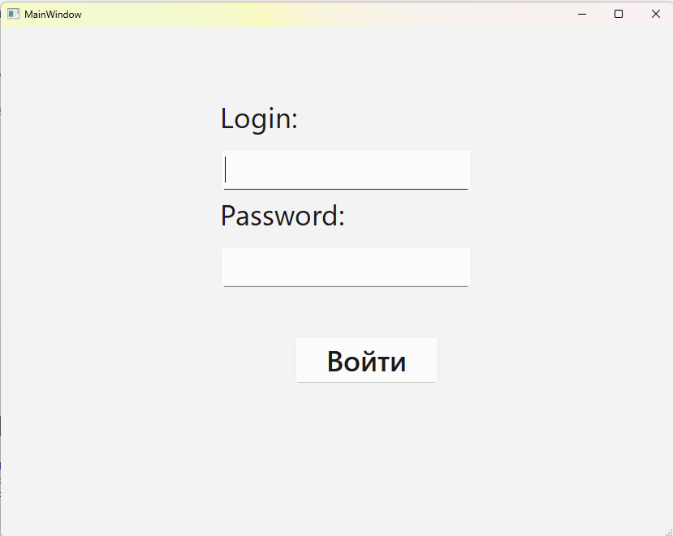
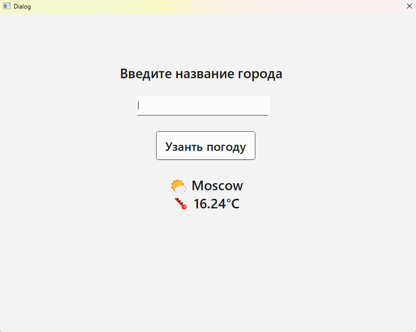
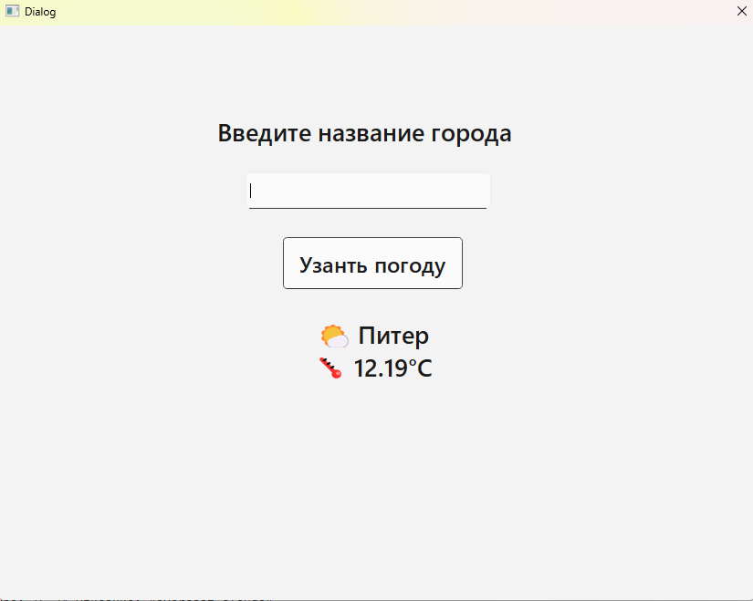

# 🌦️ WeatherApp — C++/Qt клиент-серверное приложение

Простое клиент-серверное приложение на **C++ и Qt**, позволяющее пользователям **входить в систему и просматривать погоду по выбранному городу**.

Проект разделён на 2 части:
- 📦 `client` — графическое приложение на Qt
- 🔌 `server` — серверная часть, обрабатывающая запросы

---

## 🚀 Возможности

- 👤 Авторизация пользователя по фиксированным данным
- 🏙️ Ввод города и получение прогноза погоды
- 🪟 Интерфейс на базе Qt Widgets
- 📡 Обмен данными между клиентом и сервером

---

## 🧰 Технологии

- C++
- Qt 5 / Qt 6
- TCP-сокеты (QtNetwork)
- CMake

---

## 🗂️ Структура проекта

```
/client
  ├── main.cpp
  ├── mainwindow.cpp / .h / .ui
  ├── weatherwindow.cpp / .h / .ui
  └── CMakeLists.txt

/server
  ├── main.cpp
  └── CMakeLists.txt
```

---

## 🛠️ Как собрать проект

### 📌 Требования:
- Установленный Qt (с `qmake` или `CMake`)
- Компилятор C++ (GCC / MSVC)
- Qt Creator

---

## 📸 Скриншоты

### 🔐 Авторизация


### 🌦️ Окно с погодой


### 🌦️ Окно с погодой


---

## 📬 Автор

- 💼 Usman Gamidov
- Telegram: [@At_taqwa_tw](https://t.me/At_taqwa_tw)

---

🧠 Проект разработан для практики с Qt и клиент-серверной архитектурой.
